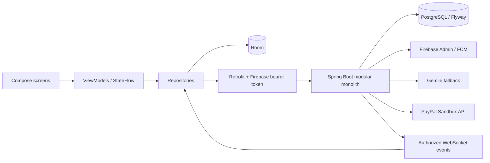

# SplitPay 

An Android expense-sharing and personal finance application built with Kotlin/Compose and a Spring Boot modular monolith. Split a trip, review a scanned receipt, track a monthly budget, and demonstrate a verified test settlement.

**PayPal Sandbox checkout is implemented for demonstration. No real money is transferred. See [PayPal setup](docs/PAYPAL_SANDBOX.md) to connect your Sandbox account.**

## Features

- Firebase email/password registration, persistent login and editable profile.
- Groups, registered members, shared expense CRUD, equal/exact/percentage/shares splits.
- Exact decimal balances, debt simplification and idempotent manual settlements.
- Personal expenses with Room persistence, pending offline changes and backend synchronization.
- CameraX capture or gallery import, bundled ML Kit OCR and mandatory editable receipt review.
- Merchant rules followed by a validated Gemini classification proxy with an Other fallback.
- Monthly/category budgets, spending trends, category distribution and top merchants.
- PayPal Sandbox browser checkout, stored USD test quotes, server-side capture checks and verified idempotent webhook processing.
- Activity feed, authenticated WebSocket updates, persisted notifications and FCM integration.
- Light/dark theme and a private debug-only seeded demo.

**Verification is separate from implementation.** See [implementation status](docs/IMPLEMENTATION_STATUS.md) for the latest test results and outstanding physical-device/external-service checks. Android Firebase configuration is present. Backend PayPal credentials and external-service acceptance are still required.

## Repository and architecture

```text
app/        Android app (existing root Gradle project preserved)
backend/    Independent Java 21 / Spring Boot project
docs/       Setup, architecture, interview and verification guides
scripts/    Local demo configuration, launch and smoke checks
```



Android uses Material 3, Hilt, Coroutines, Navigation Compose, DataStore, Room, Retrofit/OkHttp, Coil, CameraX, ML Kit and Firebase. Backend uses Spring Web/Security/Data JPA/Validation, BigDecimal and versioned SQL migrations. Redis is intentionally not deployed: this demo does not need a distributed cache, and balances are authoritative database-derived values.

## Run a local USB demo

For a hosted interview demo using free services and no running PC, follow
[the free Render + Neon setup guide](docs/FREE_INTERVIEW_SETUP.md).

Requirements: Java 21, Android SDK 36.1, USB-debuggable Android 8+ phone.

```powershell
powershell -ExecutionPolicy Bypass -File scripts/configure-demo.ps1
.\gradlew.bat -p backend test bootJar
powershell -ExecutionPolicy Bypass -File scripts/run-demo.ps1
```

Keep that backend terminal open. In another terminal:

```powershell
.\gradlew.bat :app:assembleDebug :app:testDebugUnitTest
adb devices -l
adb reverse tcp:8080 tcp:8080
adb install -r app/build/outputs/apk/debug/app-debug.apk
adb shell am start -n com.example.splitpay/.MainActivity
```

Use the SDK platform-tools path if adb is not on PATH. Choose **Explore local demo as Pratik**. The demo uses a persistent local H2 file, not PostgreSQL; its random token is generated into ignored local.properties. It binds to PC loopback. Do not expose this profile publicly.

Goa Trip includes Pratik, Rahul, Aman and Rohit, with Hotel ₹8,000, Dinner ₹2,000 and Taxi ₹1,200. Members can be added using rahul@splitpay.demo, aman@splitpay.demo and rohit@splitpay.demo. These are seeded local identities, **not Firebase login credentials**.

Use Groups → Goa Trip → Simplify debts → your outgoing suggestion → settlement. Manual settlement works without external accounts. PayPal requires backend Sandbox REST app credentials; an unavailable provider produces an actionable error.

## Production-style local setup

Read [exact console and configuration steps](docs/SETUP.md) for Firebase, Gemini, PayPal Sandbox, FCM and PostgreSQL. Copy backend/.env.example to backend/.env and supply your own values. Secrets belong only in ignored configuration/environment variables.

```powershell
docker compose --env-file backend/.env -f backend/compose.yml up -d postgres
.\gradlew.bat -p backend bootRun
```

Export database and Firebase variables into the Java process first. Docker Compose's env file is not automatically imported into bootRun. The default backend profile uses PostgreSQL and verifies Firebase tokens; migrations run automatically.

For a physical phone, use adb reverse plus the debug loopback URL, or configure splitpay.apiBaseUrl to a reachable HTTPS backend and rebuild. A release build has no demo token and does not allow cleartext HTTP.

## Payments

Android creates a settlement request with a stable UUID. The backend reserves the INR debt and stores a USD sandbox quote using an explicitly configured demonstration rate. Android shows the quote before opening PayPal in the browser. After approval, the user returns to the app and checks payment status. The backend validates and captures the stored order; only a matching COMPLETED capture changes the ledger. Repeated requests and verified webhooks are idempotent. Pending captures remain reserved, and stale debts trigger a sandbox refund. See [account setup and limitations](docs/PAYPAL_SANDBOX.md).

## Database and API

Normalized tables include users, expense_groups, group_members, expenses, expense_splits, personal_expenses, receipts, settlements, payments, payment_webhooks, budgets, activity_logs, notifications and device_tokens. Group locks serialize financial mutations; expense versions reject stale edits.

Endpoints under /api cover users/me, groups and members, expenses, balances, simplified-balances, settlements, personal-expenses, budgets/current, analytics/monthly, receipts/classify, paypal/order, paypal/verify, paypal/{settlementId}/cancel, notifications and devices. /api/live carries authenticated group invalidation events. Health, the informational PayPal return page, and provider-verified webhook endpoints are public. Legacy Razorpay backend endpoints remain for compatibility; the Android app uses PayPal.

## Tests and screenshots

```powershell
.\gradlew.bat :app:testDebugUnitTest :app:assembleDebug
.\gradlew.bat -p backend test bootJar
powershell -ExecutionPolicy Bypass -File scripts/verify-demo.ps1
```

Business tests cover rounding, all split types, balances, simplification and settlement validation. HTTP tests cover authentication, expenses, budgets and verified/idempotent payment behavior using mocked PayPal and legacy Razorpay providers. A mocked provider is not evidence of a real checkout.

Screenshots to capture from the final phone build: dashboard, group balances, receipt review, analytics, test payment success. No fabricated screenshots are included.

## Security and current limits

Firebase tokens determine identity; request user IDs never grant authorization. Provider secrets never go to Android. PayPal requests use a fixed sandbox host; credentials never reach Android. No card/CVV/PIN data is stored. Debug tokens and credential files are ignored. Group commands require connectivity; cached reads and personal pending edits work offline. Sync retries on foreground refresh, not a background WorkManager schedule. Notification dispatch is best effort after commit; a durable outbox is a future improvement. The ledger uses INR; PayPal checkout uses an explicitly displayed USD demonstration quote.

Optional Google Sign-In, item-by-item receipt allocation, imports, multi-currency conversion, Redis and microservices are intentionally outside this implementation.

See [architecture](docs/ARCHITECTURE.md) and [interview guide](docs/INTERVIEW_GUIDE.md).


